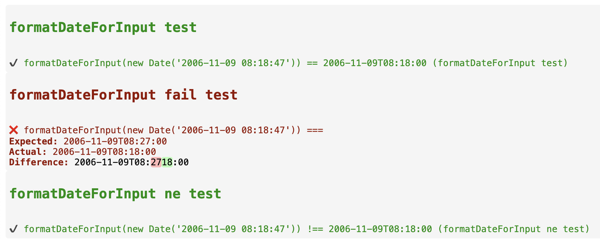

## Example

```html

<web-assert 
    expression="formatDateForInput(new Date('2006-11-09 08:18:47'))" 
    expected="2006-11-09T08:18:00" 
    message="formatDateForInput test" 
    context="tests"></web-assert>

<web-assert 
    expression="formatDateForInput(new Date('2006-11-09 08:18:47'))" 
    is="==="
    expected="2006-11-09T08:27:00" 
    message="formatDateForInput fail test" 
    context="tests"></web-assert>


<web-assert 
    expression="formatDateForInput(new Date('2006-11-09 08:18:47'))" 
    is="!=="
    expected="2006-11-09T08:27:00" 
    message="formatDateForInput ne test" 
    context="tests"></web-assert>


<script type="module">
    import { formatDateForInput } from './dates.mjs';

    window.tests = {
        formatDateForInput
    }

    import('./web-assert.mjs');
</script>
```

## dates.mjs
```javascript
export function formatDateForInput(date) {
    const pad = (num) => String(num).padStart(2, '0');

    const year = date.getFullYear();
    const month = pad(date.getMonth() + 1); // Months are 0-based
    const day = pad(date.getDate());
    const hours = pad(date.getHours());
    const minutes = pad(date.getMinutes());

    return `${year}-${month}-${day}T${hours}:${minutes}:00`;
}
```

## Result

